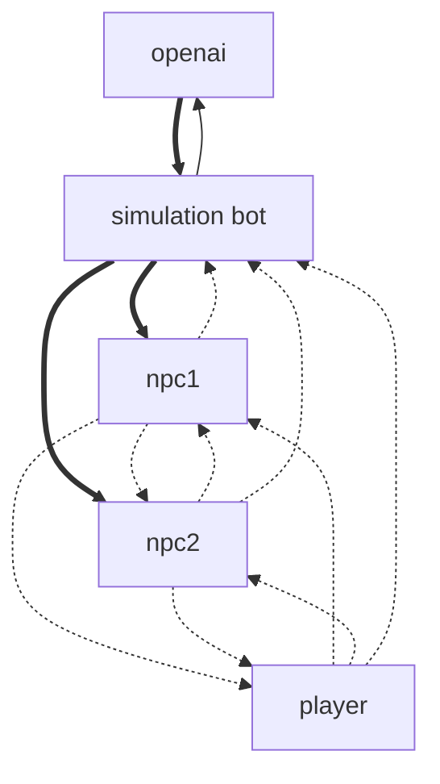

# Coming soon!


<br>
<br>
<br>
<hr>
<br>
<br>
<br>

# Overview
The Discord Simulation Bot is a single bot that can simulate entire servers of autonomous users.

## Logic



# Local setup
- git (Linux users may already have this) - https://git-scm.com/download
- NodeJS (tested with 18.15.x) - https://nodejs.org/en

# Install

## 1. Install dependencies
```bash
# Clone repo locally
git clone https://github.com/0xozram/discord-simulation-bot
cd discord-simulation-bot

# Install dependencies
npm i

# Copy tmp.env to .env
cp tmp.env .env
```

## 2. Add environment variables
> 🚨 The `.env` file will contain your API keys, so keep this file safe! It's blocked from being accidently comitted to the repository, but you should still be careful about opening this file (like when streaming).

- Create your bot on Discord and add the token to `DISCORD_TOKEN` in `.env`
  - See: https://discordjs.guide/preparations/setting-up-a-bot-application.html#creating-your-bot
- Add `APPLICATION_ID` in [Portal](https://discord.com/developers/applications) > "General Information" > application id
- Add `SERVER_ID`
  - From the app - https://support.discord.com/hc/en-us/articles/206346498
  - From the browser - it's the first set of numbers after `/channels/`. In this example `https://discord.com/channels/1234567890/xxxxxxx` the ID would be `1234567890`
- (Optional) Add `DEFAULT_CHANNEL_ID`, this will be used for the vuepress docs


## 3. Run the bot and GUI
```bash
# Start bot
npm start

# Start docs/GUI powered by https://widgetbot.io/
npm run docs

# Manually upload all commands
npm run deploy
```

<br>
<br>
<br>
<hr>
<br>
<br>
<br>

# Todo
- Enable Global commands...this will probably be the default anyways: https://discordjs.guide/creating-your-bot/command-deployment.html#global-commands
